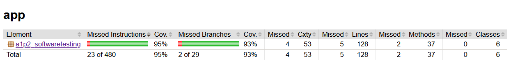

# Assignment1-XUnit-part-2
Single or Pair-wise student Assignment
Library Management System (LMS)

## Suggestions:
- Language of Implementaiton: Java
- Framework for unit-testing: JUnit Jupiter
- Framework for mocking: Mockito
- Jacoco for code coverage

## How to run code coverage:
- ./gradlew test
- ./gradlew jacocoTestReport
- cd app/javacocoHtml
- start index.html

*The last command will show the code coverage results in the browser* 

## Application Idea:
### Library Management System

#### Simulate a basic system to manage books in a library.
**Classes:**

- Book: Represents a book with attributes like title, author, and ISBN.
- Member: Represents a library member with attributes like name and ID. 
- Loan: Handles borrowing and returning books.
- Library: Manages the collection of books and members.

- LibraryApp: where the application runs from
- LibraryView: creating the console interaction for user

**Example Features:**

- Add/remove books.
- Borrow/return books.
- Track which member has borrowed which book.